# django-cinemateca
_________________________________________

######
Welcome to Cinemateca, a Django-based platform designed specifically for directors. The site offers a unique space where directors can register, create, and manage their film projects.

## Getting Started:

* Clone the repository
`git clone `
* Install dependencies
`pip install -r requirements.txt`
* Create a `.env` file in the project root directory.
* Add the necessary configurations `SECRET_KEY=your_django_secret_key`
* Apply database migrations to set up your database schema: 
`python manage.py makemigrations`
`python manage.py migrate`
* Running the development server `python manage.py runserver`
* Open your web browser and go to http://127.0.0.1:8000 to see the project in action.

#### Database Diagram:

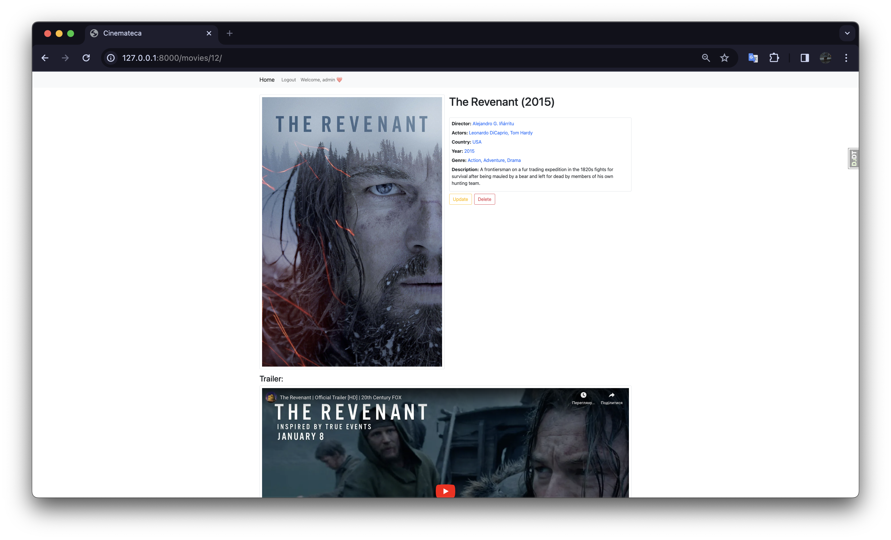
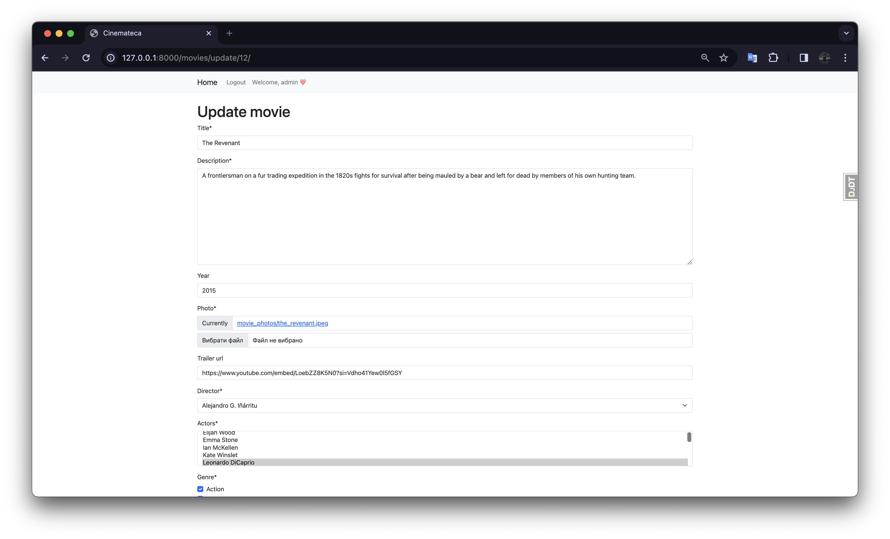
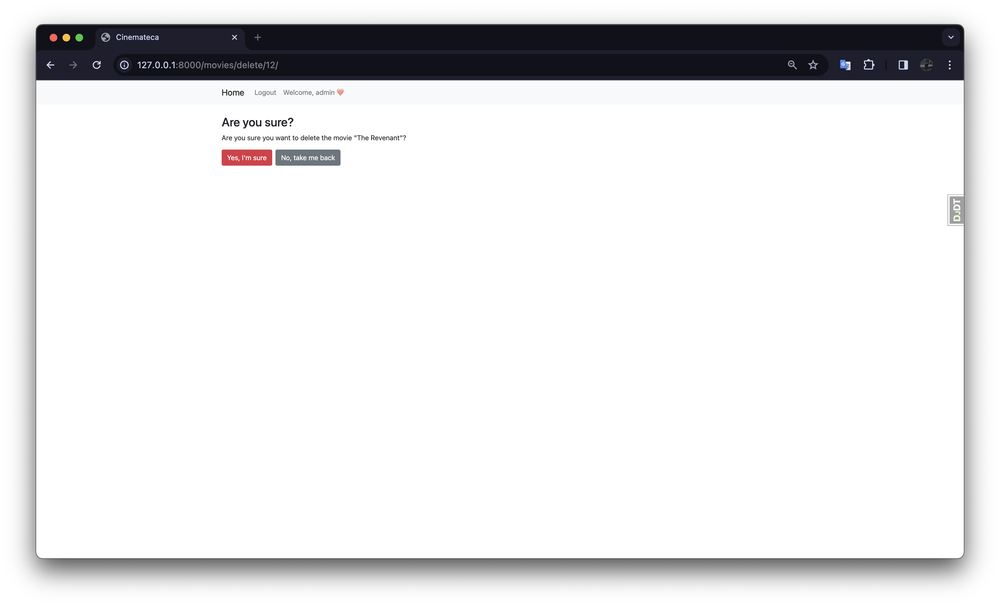
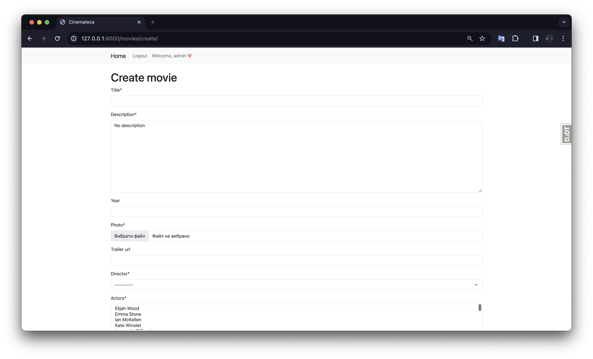
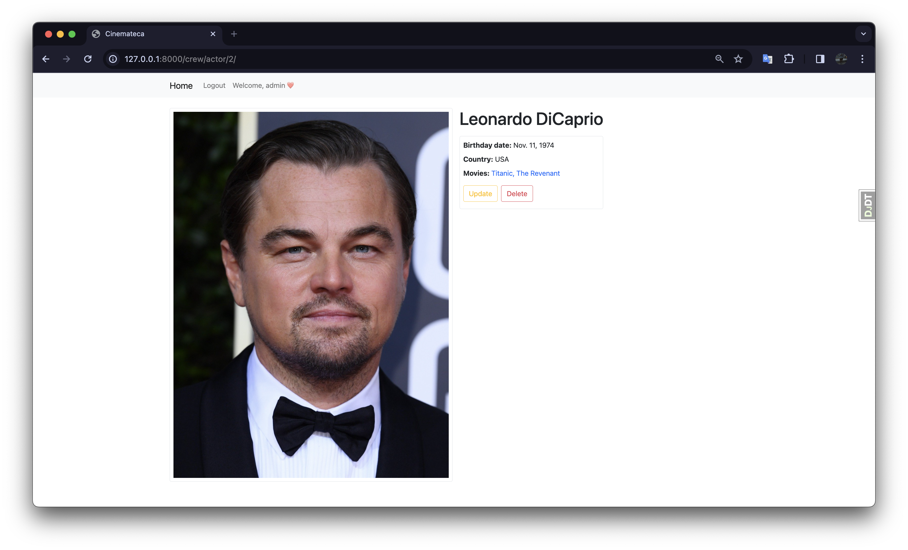

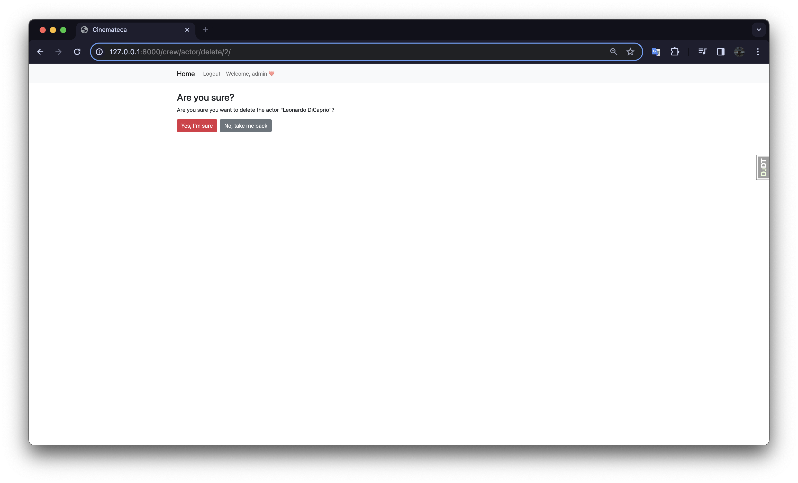
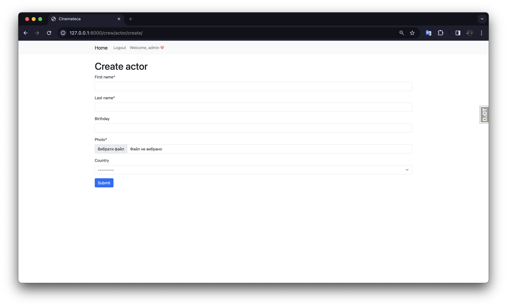
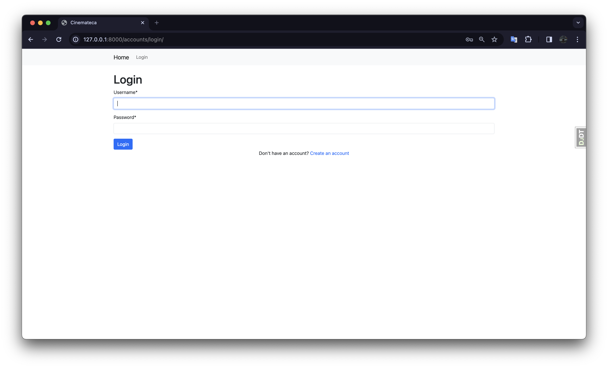
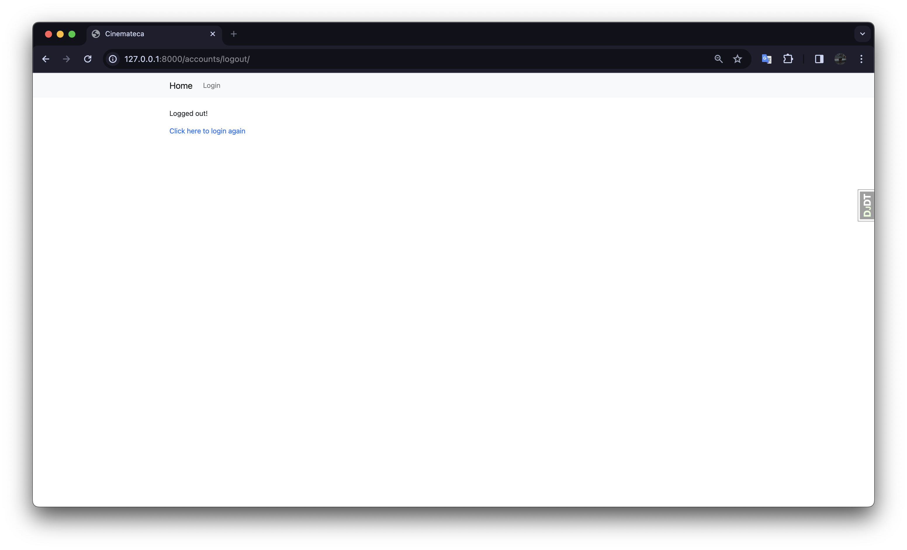
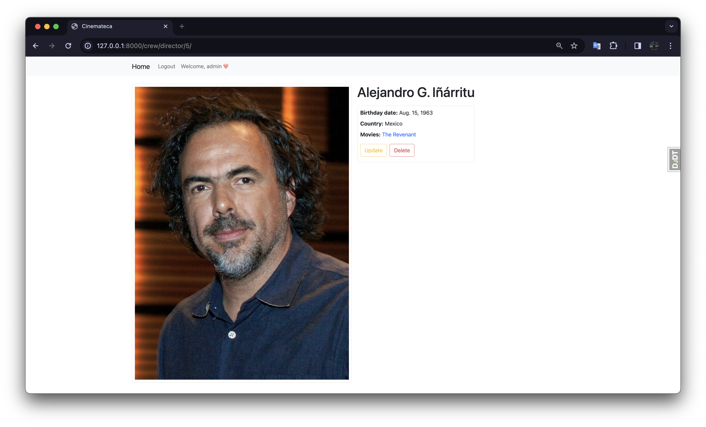
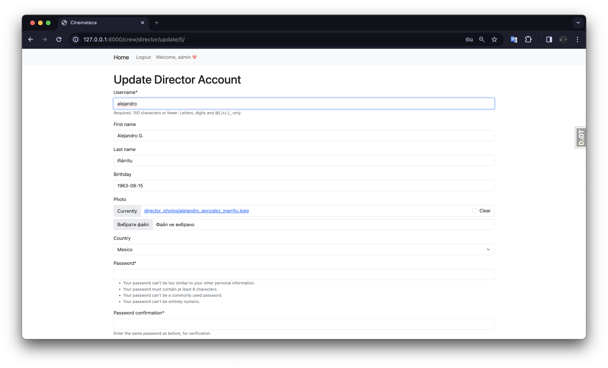
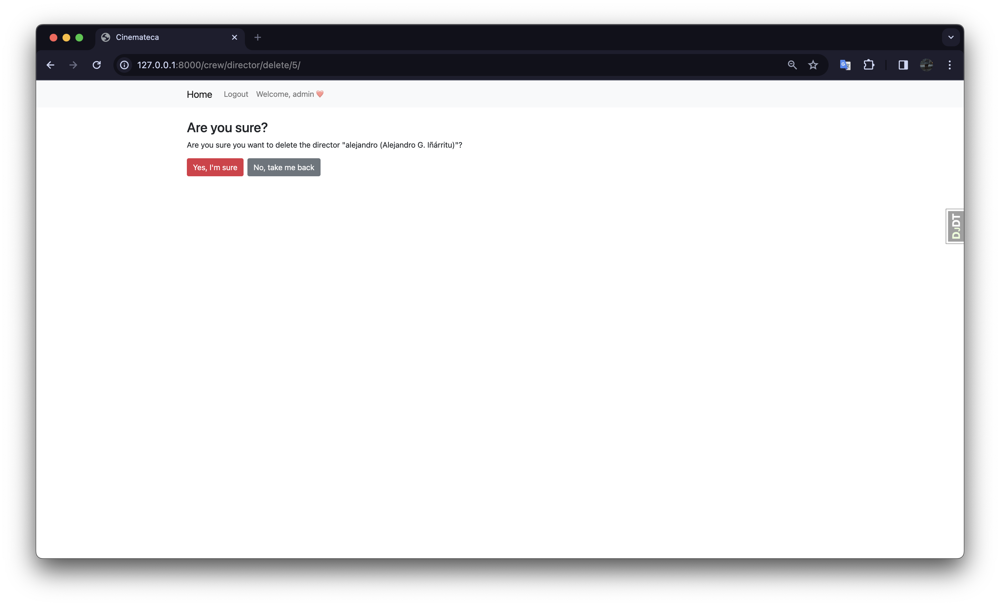
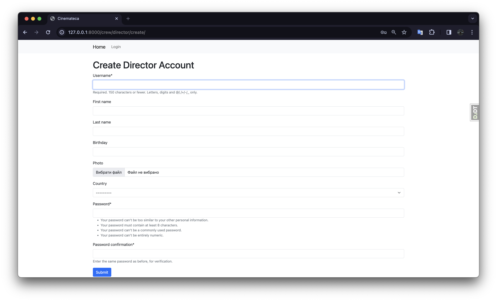

